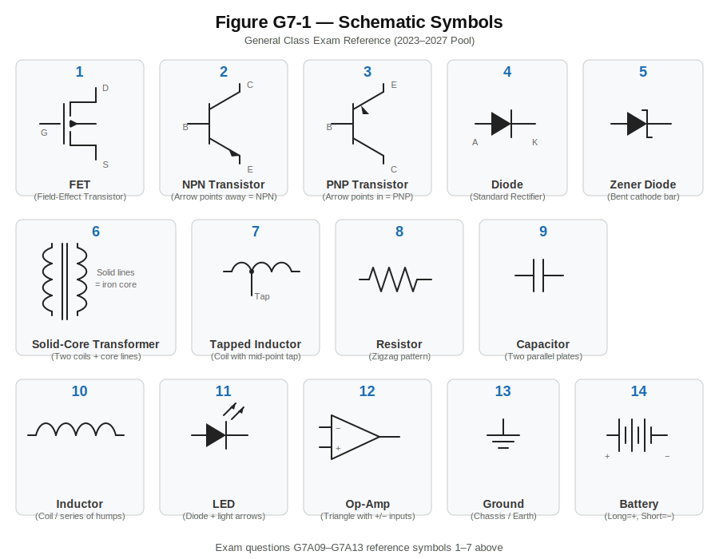

# G7 — Practical Circuits

This subelement is where theory meets hardware. G5 taught you how reactance, impedance, and resonance work mathematically. G6 showed you the actual components — diodes, transistors, capacitors, ferrite cores. Now G7 puts it all together into working circuits: power supplies, amplifiers, oscillators, filters, receivers, transmitters, and software-defined radios. You'll see 3 questions on your exam drawn from a pool of 38.

If G5 was physics and G6 was parts, G7 is engineering — how those parts get wired together to do useful work.

---

## Power Supplies: From AC to DC

Every piece of amateur radio equipment needs DC power, but the wall outlet delivers AC. A power supply converts AC to usable DC through four stages: **transformation → rectification → filtering → regulation**. Understanding this chain is key to the exam questions.

### Rectification: The One-Way Gate

Rectification converts AC to pulsating DC using diodes — the one-way valves from G6 (silicon = 0.7V forward threshold, germanium = 0.3V).

#### Half-Wave Rectifier

The simplest possible rectifier: **one diode**. It passes the positive half of the AC cycle and blocks the negative half. That's 180° out of the full 360° cycle — exactly half.

The result is a series of DC pulses at the **same frequency as the AC input** (60 Hz in → 60 Hz pulses out). This is inefficient — half the available energy is wasted — but sometimes simplicity is more important than performance, like in low-current bias supplies.

#### Full-Wave Rectifier (Center-Tapped)

Uses **two diodes and a center-tapped transformer**. The center tap provides a ground reference point. Each diode handles one half of the AC cycle, so the output captures **360°** — the entire waveform. During the negative half-cycle, the second diode and the lower half of the transformer winding flip the polarity, contributing to the positive output.

The key difference from half-wave: the output has pulses at **twice the input frequency** (60 Hz in → 120 Hz pulses out). More pulses means smoother DC after filtering, and higher ripple frequency is easier to filter.

#### Full-Wave Bridge Rectifier

Also captures 360° of the cycle, but uses **four diodes** in a bridge configuration — no center-tapped transformer needed. The bridge and center-tapped designs produce the same output; they just get there differently.

> **Exam tip:** "Full-wave with center-tapped transformer" = 2 diodes. "Full-wave bridge" = 4 diodes. The exam tests both types. Half-wave = 1 diode. The number of diodes is the distinguishing feature.

### Filtering: Smoothing the Bumps

Raw rectifier output is pulsating DC — usable for a light bulb, but terrible for radio circuits that need clean, steady voltage. The **filter network** smooths these pulses into something closer to pure DC.

Filter networks use **capacitors and inductors** — a direct application of G5 reactance concepts:

- **Capacitors** charge up during voltage peaks and release stored energy during dips, filling in the valleys between pulses. They pass AC ripple to ground because their reactance is low at the ripple frequency (X_C = 1/(2πfC) — remember from G5).
- **Inductors** resist sudden changes in current, further smoothing the flow. Their reactance is high at the ripple frequency (X_L = 2πfL), blocking the AC component.

Together, capacitors and inductors work as a team: the capacitor shunts AC ripple to ground while the inductor blocks it from reaching the load. This is why full-wave rectifiers produce easier-to-filter output — 120 Hz ripple is easier to filter than 60 Hz because both X_L is higher and X_C is lower at the higher frequency.

### The Bleeder Resistor: A Safety Feature

A **bleeder resistor** is connected across the filter capacitors to discharge them when the power supply is turned off. Without it, those capacitors can hold a lethal charge for minutes or hours — especially in high-voltage tube amplifier supplies. It's a safety component, not a performance feature.

### Switchmode vs. Linear Power Supplies

Traditional linear power supplies use a big 60 Hz transformer and are heavy but simple. Switchmode supplies convert the incoming AC to DC, then chop it at **high frequency** (typically 50 kHz to several MHz) before transforming and filtering.

The advantage: **high-frequency operation allows much smaller components**. From G5, you know that transformer efficiency depends on the rate of current change — at 100 kHz, a tiny ferrite-core transformer replaces a heavy iron-core one. Filter capacitors and inductors can be smaller too, because they're more effective at higher frequencies. This is why your laptop charger weighs ounces while a 1970s linear supply weighs pounds.

The tradeoff: switchmode supplies generate high-frequency noise that can interfere with receivers — a real concern in amateur radio installations.

---

## Schematic Symbols: Reading the Map

The exam tests your ability to identify components from their schematic symbols using Figure G7-1. Study the figure carefully — five exam questions reference it directly.

You should be able to recognize:

- **FET (Field-Effect Transistor):** Shows a channel with a gate that doesn't directly touch it — reflecting the electric-field control from G6. The arrow direction indicates N-channel or P-channel.
- **Zener diode:** Looks like a regular diode but with bent/kinked ends on the bar (cathode). The visual cue for "this operates in reverse breakdown."
- **NPN transistor:** Three leads — base, collector, emitter. The arrow on the emitter points AWAY from the base ("Not Pointing iN" is a common mnemonic).
- **Solid-core transformer:** Two coils (inductors) side by side with solid lines between them indicating the iron or ferrite core. No lines = air core.
- **Tapped inductor:** A coil symbol with an additional connection partway along, providing access to a fraction of the total inductance.

> **Study strategy:** Don't just memorize which symbol number is which component. Understand WHY each symbol looks the way it does — it reflects the component's physical structure.

---

## Amplifiers: Gain, Efficiency, and Linearity

Amplifiers make signals bigger. The exam focuses on three aspects: amplifier classes, efficiency, and linearity.

### Amplifier Classes

The "class" of an amplifier describes how much of the input cycle the active device conducts:

| Class | Conduction | Efficiency | Linearity | Use Case |
|-------|-----------|------------|-----------|----------|
| **A** | 100% of the cycle | 25-50% | Excellent | Driver stages, preamplifiers |
| **B** | 50% of the cycle | ~65% | Fair | Push-pull audio output |
| **AB** | 50-100% | 50-65% | Good | SSB transmitter finals |
| **C** | <50% of the cycle | 60-80% | Poor | FM transmitters, CW |

**Class A** conducts the entire cycle — the device never turns off. This gives the most faithful reproduction of the input waveform (highest linearity) but wastes the most power as heat. At least half the DC input becomes heat even with no signal present.

**Class C** has the highest efficiency because the device is OFF for most of the cycle. Brief pulses of current drive a tuned output circuit (tank circuit) that reconstructs the sine wave through resonance — like pushing a swing at just the right moment. The waveform gets badly distorted, but the tank circuit cleans it up.

### Class C and FM: A Perfect Match

**Class C is appropriate for FM** but NOT for SSB or AM. Here's why: FM carries information in frequency changes, not amplitude changes. The amplitude of an FM signal is constant, so it doesn't matter if Class C clips the waveform — no information is lost. The tuned output circuit restores the sine wave shape.

SSB and AM carry information in amplitude variations. Class C's clipping destroys that information, causing unintelligible distortion and splatter into adjacent channels.

### Linear Amplifiers

A **linear amplifier** preserves the input waveform — the output is an amplified but faithful copy. "Linear" means the output is directly proportional to the input at all amplitude levels. Class A and Class AB are linear. Class C is not.

SSB transmitters must use linear amplifiers (typically Class AB for the final stage) because the voice information lives in the amplitude envelope. Any amplitude distortion generates unwanted sideband energy.

### Efficiency

RF power amplifier efficiency = **RF output power ÷ DC input power × 100%**

If an amplifier draws 500W from the supply and delivers 300W of RF, efficiency is 60%. The other 200W becomes heat. Higher efficiency means less wasted heat, smaller power supplies, and smaller heatsinks.

### Neutralization

When an amplifier self-oscillates — producing an unwanted signal instead of just amplifying — it needs **neutralization**. Self-oscillation occurs when output energy feeds back to the input in-phase, creating unintended positive feedback. This is the same plate-to-grid capacitance problem that the screen grid addresses in vacuum tubes (from G6).

Neutralization adds a canceling signal that's equal in amplitude but opposite in phase to the unwanted feedback, eliminating the oscillation while preserving normal amplification.

---

## Digital Circuits: Logic, Counters, and Registers

Amateur radio equipment is increasingly digital. The exam tests a few fundamental digital concepts.

### Logic Gates

An **AND gate** outputs HIGH only when BOTH inputs are HIGH. Think of it as two switches in series — both must be closed for current to flow.

Truth table for a 2-input AND:

| Input A | Input B | Output |
|---------|---------|--------|
| 0 | 0 | 0 |
| 0 | 1 | 0 |
| 1 | 0 | 0 |
| 1 | 1 | 1 |

Other gates you should know: OR (output high when EITHER input is high), NOT (inverts the input), NAND (AND + NOT — output high unless both inputs are high).

### Binary Counters

A binary counter counts in base-2. The number of states equals **2^N** where N is the number of bits:

- 3-bit counter: 2³ = **8 states** (counts 0 through 7: 000, 001, 010, 011, 100, 101, 110, 111)
- 4-bit counter: 2⁴ = 16 states
- 8-bit counter: 2⁸ = 256 states

Binary counters are used as frequency dividers in amateur radio equipment — divide a 10 MHz reference by 2 and you get 5 MHz, by 4 (two stages) you get 2.5 MHz, and so on.

### Shift Registers

A **shift register** is a clocked array of flip-flops that passes data one step along the chain with each clock pulse. Think of a bucket brigade: each person passes their bucket to the next person in line with each "clock" command.

Shift registers are used for:
- Serial-to-parallel data conversion (receiving bits one at a time, presenting them all at once)
- Parallel-to-serial conversion (the reverse)
- Data buffering and delay lines
- Digital communications interfaces

---

## Oscillators: Generating Signals

An oscillator generates a continuous AC signal without an external AC input. The exam covers two key aspects.

### The Feedback Loop

A sine wave oscillator requires two things: **a filter and an amplifier operating in a feedback loop**. The amplifier provides gain, the filter selects the frequency, and the feedback loop sustains the oscillation.

For oscillation to start and sustain, two conditions must be met (the Barkhausen criterion):
1. The loop gain at the oscillation frequency must be exactly 1
2. The total phase shift around the loop must be 0° (or 360°)

Without the feedback loop, you just have an amplifier. Without the filter, you'd get broadband noise, not a clean sine wave.

### LC Oscillators

The frequency of an LC oscillator is determined by **the inductance and capacitance in the tank circuit** — using the resonant frequency formula from G5:

**f = 1/(2π√(LC))**

This is the same resonance concept from G5: at the resonant frequency, X_L equals X_C. The tank circuit oscillates naturally at this frequency, and the amplifier replaces the energy lost to resistance each cycle.

Variable-frequency oscillators (VFOs) use a variable capacitor to tune the frequency — change C and you change f. Crystal oscillators use a quartz crystal, which behaves like an extremely precise LC circuit with a very high Q, giving exceptional frequency stability.

### Direct Digital Synthesizers (DDS)

A DDS produces a **variable output frequency with the stability of a crystal oscillator**. It works digitally: a counter clocked by a crystal reference steps through a sine wave lookup table, outputting samples that are converted to analog. Since every output frequency is derived from the crystal reference, they all share its stability.

DDS advantages: near-instant frequency changes (no mechanical tuning or PLL settling), very fine frequency resolution, and crystal-reference stability at any output frequency. The tradeoff is quantization artifacts in the output that need filtering.

---

## Receivers and Transmitters: The Signal Chain

### SSB Signal Generation

Generating an SSB signal is a multi-step process:

1. **Balanced modulator** → Combines audio with carrier, producing **double-sideband suppressed-carrier** (DSB-SC). The carrier cancels out due to the circuit's symmetry; both sidebands remain.
2. **Filter** → Selects one sideband and rejects the other. A crystal or mechanical filter with a narrow passband does this.
3. **Mixer/upconverter** → Translates the SSB signal to the desired transmit frequency.
4. **Amplifier chain** → Boosts the signal to transmit power (using linear amplifiers — Class AB — to preserve the envelope).

### SSB Reception: The Product Detector

Receiving SSB requires a **product detector** — a mixer that combines the received signal with a locally generated carrier (BFO — Beat Frequency Oscillator). Since the original carrier was suppressed during transmission, the receiver must reinsert one. The product detector multiplies the two signals together, recovering the original audio. Without it, SSB sounds like unintelligible Donald Duck quacking.

### Impedance Matching at the Output

A transmitter's output impedance matching transformer **presents the desired impedance to both the transmitter and the feed line**. From G5, maximum power transfer requires matched impedances. The transformer uses the turns ratio relationship (Z_ratio = (N₁/N₂)²) to bridge the gap between the transmitter's optimal load impedance and the actual feed line impedance.

---

## Filters: Selecting What You Want

Filters are everywhere in radio circuits — selecting signals, rejecting interference, smoothing power supplies. The exam tests your understanding of filter specifications.

### Key Filter Terms

| Term | What It Measures |
|------|-----------------|
| **Cutoff frequency** | Where output drops to half power (-3 dB) — the passband boundary |
| **Insertion loss** | Signal loss INSIDE the passband (ideally zero) |
| **Ultimate rejection** | Maximum attenuation OUTSIDE the passband (the deeper the better) |
| **Bandwidth** | Distance between the upper and lower half-power points |

**Cutoff frequency** defines where a low-pass filter's passband ends — the frequency above which output power is less than half the input power. Remember from G5: half power = -3 dB.

**Insertion loss** is the unwanted attenuation of signals you WANT to pass through. A perfect filter has zero insertion loss. Real crystal filters might have 1-2 dB. Think of it as the toll you pay for filtering.

**Ultimate rejection** is the filter's maximum ability to block signals you DON'T want. A filter with 80 dB ultimate rejection reduces unwanted signals by a factor of 100 million.

**Bandwidth** of a band-pass filter is measured between the **upper and lower half-power points** (-3 dB points). A typical SSB crystal filter might have a 2.4 kHz bandwidth; a CW filter might be 500 Hz or narrower.

### DSP Filters: Software-Defined Filtering

The biggest advantage of DSP (Digital Signal Processing) filters over analog filters: **a wide range of bandwidths and shapes can be created in software**. An analog crystal filter has a fixed bandwidth — change it and you need a different crystal. A DSP filter is just math: adjust the parameters and you instantly have a different bandwidth, shape factor, or filter type.

Modern SDR transceivers use DSP filters to give operators continuously variable bandwidth — something impractical with analog hardware. This is one of the things that makes SDR so powerful.

---

## Software-Defined Radio (SDR): The Modern Approach

SDR replaces dedicated hardware circuits with software algorithms. Where a traditional radio uses physical crystal filters, diode detectors, and analog modulators, an SDR does these jobs mathematically. **Filtering, detection, and modulation** — all performed in software.

### I/Q: The Foundation of SDR

SDR relies on **I/Q (In-phase/Quadrature) signals** — two copies of the received signal that are **90 degrees** apart in phase. I = In-phase, Q = Quadrature (literally "quarter turn" = 90°).

Why 90°? A single sample stream can't distinguish between positive and negative frequencies — you'd get mirror images (aliases) that corrupt the signal. By sampling at two points exactly 90° apart, the SDR captures complete information about both the amplitude AND phase of the signal, eliminating this ambiguity.

### I/Q Modulation: Universal Capability

The killer advantage of I/Q modulation: **all types of modulation can be created with appropriate processing**. Because I/Q completely represents a signal's amplitude and phase at every instant, you can mathematically construct any modulation scheme — AM, FM, SSB, PSK, QAM, or anything else.

This is the fundamental power of SDR: change the software algorithm and you change the modulation type. No hardware modifications needed. Today your radio does SSB; update the firmware and it does a mode that hasn't been invented yet.

### Receiver Sensitivity

Receiver sensitivity — the ability to detect weak signals — depends on **all three** of these factors working together:

1. **Input amplifier noise figure** — How much noise the first amplifier stage adds. Lower is better. This is typically the dominant factor.
2. **Input amplifier gain** — How much the signal gets boosted before noise from later stages degrades it.
3. **Demodulator bandwidth** — How much noise enters the detection stage. Wider bandwidth = more noise.

This is why narrowing your IF filter bandwidth improves sensitivity: you're reducing the noise that competes with the signal, even though the signal itself gets no stronger.

---

## Quick Reference: Key Facts for G7

| Topic | Key Fact |
|-------|----------|
| Bleeder resistor | Discharges filter caps when power removed (safety) |
| Power supply filter | Capacitors and inductors |
| Half-wave rectifier | 1 diode, 180° of cycle, ripple = input frequency |
| Full-wave (center-tap) | 2 diodes, 360° of cycle, ripple = 2× input frequency |
| Unfiltered full-wave output | DC pulses at twice AC input frequency |
| Switchmode advantage | Smaller components due to high-frequency operation |
| FET symbol clue | Gate doesn't touch channel |
| Zener symbol clue | Bent/kinked ends on cathode bar |
| NPN arrow | Points away from base |
| Class A conduction | 100% of cycle |
| Highest efficiency class | Class C |
| Class C appropriate for | FM (not SSB or AM) |
| Linear amplifier | Preserves input waveform |
| Amplifier efficiency formula | RF output power ÷ DC input power |
| Neutralization purpose | Eliminates self-oscillation |
| AND gate output | High only when BOTH inputs high |
| 3-bit counter states | 2³ = 8 |
| Shift register | Clocked array, passes data in steps |
| Oscillator components | Filter + amplifier in feedback loop |
| LC oscillator frequency | Determined by L and C in tank circuit |
| DDS key advantage | Variable frequency, crystal stability |
| Balanced modulator output | Double-sideband, carrier suppressed |
| Sideband selection | Filter after balanced modulator |
| Product detector use | SSB reception (reinserts carrier) |
| Output matching purpose | Present correct impedance to transmitter and feed line |
| Cutoff frequency | Half-power point (-3 dB) |
| Insertion loss | Attenuation INSIDE passband |
| Ultimate rejection | Maximum attenuation OUTSIDE passband |
| Band-pass bandwidth | Between upper and lower half-power points |
| DSP filter advantage | Wide range of bandwidths/shapes in software |
| I/Q phase difference | 90 degrees |
| I/Q modulation advantage | All modulation types possible |
| SDR software functions | Filtering, detection, AND modulation |
| Receiver sensitivity factors | Gain, noise figure, AND bandwidth — all three |

---

## Study Tips for G7

1. **Power supply chain:** Transformation → rectification → filtering → regulation. Know what each stage does and which components it uses.
2. **Half vs. full-wave:** Count the diodes (1 vs. 2 or 4), count the degrees (180° vs. 360°), know the ripple frequency (1× vs. 2× input).
3. **Amplifier classes by efficiency:** A < AB < B < C. More conduction time = more linear but less efficient.
4. **Class C + FM:** FM doesn't care about amplitude distortion. SSB does. This is THE key principle for the amplifier class questions.
5. **Oscillator = feedback loop:** No feedback, no oscillation. The filter picks the frequency, the amplifier sustains it.
6. **SSB generation chain:** Balanced modulator (makes DSB) → filter (selects one sideband) → mixer → amplifier.
7. **Filter terms:** Insertion loss = loss INSIDE passband. Ultimate rejection = blocking OUTSIDE passband. Don't swap them.
8. **SDR = software does everything:** Filtering, detection, modulation — all software. I/Q at 90° is the foundation.
9. **Build on G5:** Reactance concepts explain WHY filters work, WHY tank circuits oscillate, and WHY higher ripple frequency is easier to filter. The connections are real.
10. **Schematic symbols:** Understand what each symbol represents physically — the FET gate gap, the Zener's kinked bar, the NPN arrow direction. Visual understanding beats memorization.
